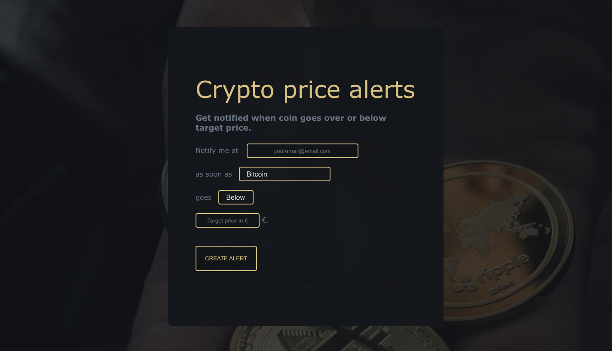
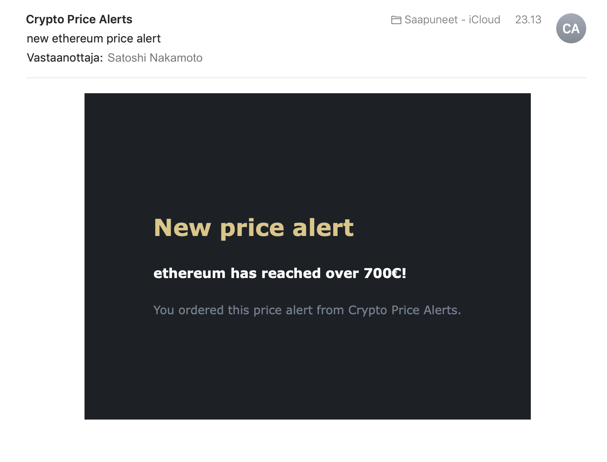

# crypto-price-alerts

Small fullstack web app that allows you to set price alerts on Cryptocurrency tokens.

Application will notify user by email when the selected crypto token will hit desired price.

Crypto price alerts uses [Coingecko API](https://www.coingecko.com/en/api) for the data.

React frontend with express REST API backend.

## Setup

Before you can start using the app you'll need the following:  
1. Get Mailjet account (Or any other email server account eg. Sendgrid, Mailgun etc..)  
You can create free account on www.mailjet.com  

2. Get SMTP credentials (comes with Mailjet)  

3. Set your environmental variables
   - **Backend**  
Create .env file in the root of the backend folder.  
You'll need to add the following variables:  
PORT (eg. 3000 if you are running in on localhost)  
USERNAME (Your Mailjet username)  
PASSWORD (Your Mailjet password)  
EMAIL (Your email where you are sending your mails)  
   - **Frontend**  
Create .env file in the crypto_alert folder.  
Add REACT_APP_API variable which will point to your backend address. (Most likely http://localhost:3000)

4. Run `npm install` in backend and crypto_alert directories.

5. You are ready to try it out!  
Run `node server.js` in backend folder and `npm start` in crypto_alert folder to start the servers.

## Images

&nbsp;

## Important notes  

*This application is only for testing purposes. You shouldn't trust in any serious crypto trading.*

*This app is not using any database, so once you shut down the server, app is not going to be able to continue tracking ongoing price requests once the server restarts.*

*If you are using common email providers to send the messages (icloud, hotmail, gmail etc.) all mails will go to receivers spam folder. This can be solved by using professional
email address to send messages (eg. email@yourdomain.com)*
